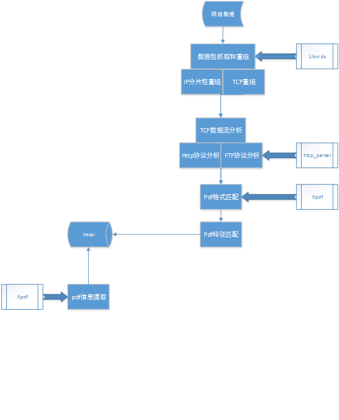

# about project
a detector detects pdf data in network stream got by libnids frame
# frame and libs
* base on libnids to capture the data stream to tcp
* http-parser-master lib help to paring tcp stream to http request
* analyze pdf format from http request body by xpdf lib
* procss the business logic by mysql
* using boost to support cross-platform
# platform and build environment
* support both windows and linux
* windows build with msvc2005
* linux build with makefile(make prebuild && make build)
# document and comment

PDF传输检测项目说明

主要模块已及相关解决方案
  因为项目需适用于Windows和Linux  2个平台，所以选用了跨平台的库和组件
1.	PDF格式解析				----------		xpdf
2.	PDF特征提取与存储		----------		mysql
3.	网络数据包的抓取			----------		libnids
4.	网络数据包的分析			----------		TCP协议的重组，Http协议分析
5.	数据流中的pdf匹配		----------		xpdf
6.	整体框架，多线程模型		----------		boost

* 项目大体框架

* 数据库表设计

 
相关说明
1.	初步设计pdf特征为 pdf文档各个信息（标题，页数，Id号，作者等具有标志性的字段）计算之后的hash，如不准确可以考虑多加入字段或多hash。
2.	考虑到应用场景为 [学生浏览pdf或者下载pdf时截获数据流进行pdf匹配] ，主要考虑http协议的pdf下载(有的浏览器可能支持多线程下载)
3.	考虑服务器数据流量可能比较大，使用了多线程模块来分析数据包

* 代码目录结构说明

* 代码编译说明
	
0.	Windows编译环境为VS2005，已经配置好，可一键编译
Linux环境编译: 
1.需先安装mysql和相关开发包
2.cd到code目录，先make prebuild，然后make即可
1．	第三方库bug修复见《第三方库的配置说明.doc》，项目代码中已经修复
2．	需要编译的第三方库为boost和xpdf
3．	boost库只使用了(date_time thread locale filesystem)，只需编译这些库即可
4．	Xpdf的编译需要freetype库的支持(已经拷贝到xpdf目录)，编译时包含目录中加入freetype的目录。xpdf本身的编译类型是应用程序，本项目把它编译成了静态库以供使用

* 安装和配置说明
1.	安装winpcap(windows)
2.	安装Mysql，导入数据库sql文件(pdf_hit_detector.sql)(windows版需手动导入，linux脚本会自动导入)
3.	将pdf_hit_detector.cfg  xpdfrc(xpdf配置文件) language_package(xpdf语言包)拷贝到程序所在目录(windows工程已经自动实现，linux编译脚本已自动实现)，根据环境修改配置内容
4.	运行程序，不带参数运行为监控模式，带参数运行为提取特征模式，2个参数，第一个参数为pdf的文件路径，第二个参数为pdf的描述，将在output目录生成提取的文本信息的同名txt文件。

* 配置文件说明

 
注：程序运行时，当前目录必须为程序所在的当前目录(VS调试启动时会用工程所在目录作为当前目录，注意设置其工作目录)，因为xpdfrc中配置language_package中的文件名才用了当前目录作为相对定位的标准。

* 代码说明
	 

# third part libs fixed bugs

* Libnids 设置缓冲区（windows）

 
Libnids使用的是libpcap的接口，libpcap在windows版本(winpcap) 提供了 pcap_setbuff的接口来设置内核的缓冲区。这里设置大一点防止丢包。

* 修复Ip包的数据长度
 

参考
http://baike.baidu.com/link?url=GhUuUCzm2reOvdVntAuxkOfI0khP2NcrrhUp2bkdzZIg1TojK3QtO0UQoJcemDGEdtcguC1rRdJvhEKq5tTZe_

* 屏蔽checksum的计算

* 屏蔽tcp window seq 校验

* 设置包的最大捕获长度

* boost threadpool build编译不通过解决

